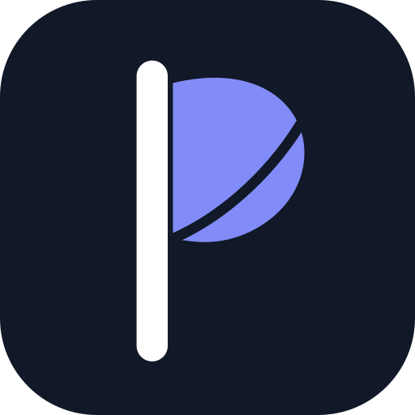
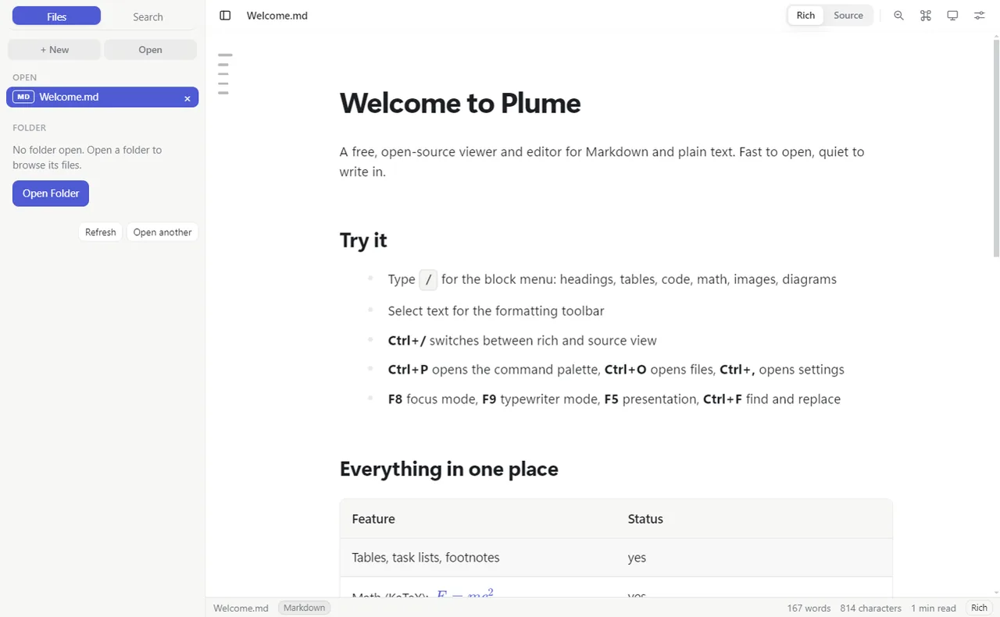
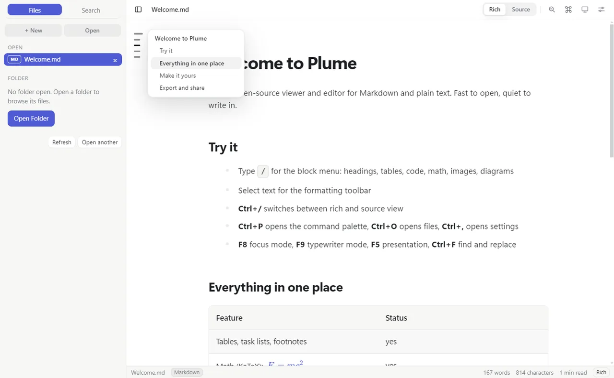
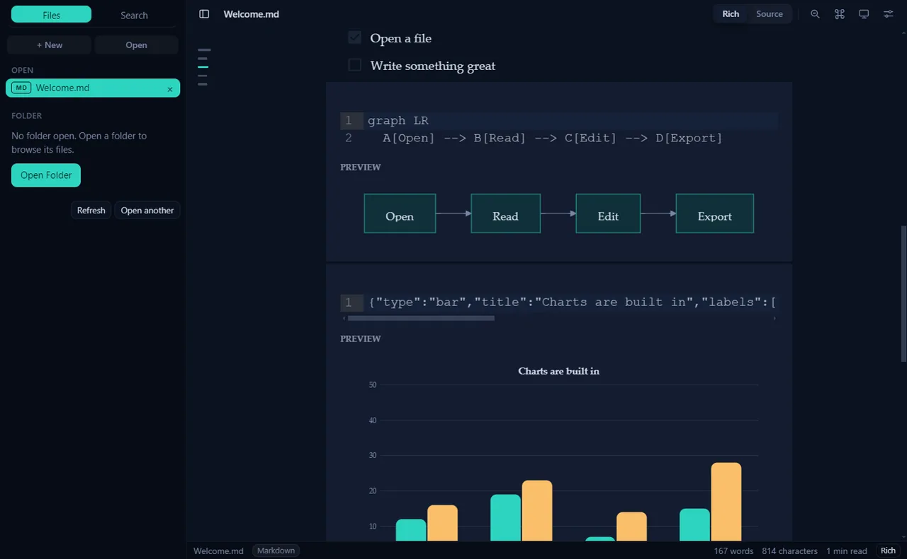
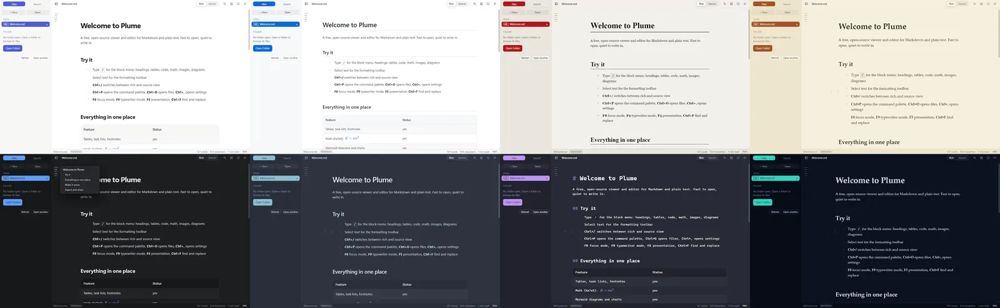
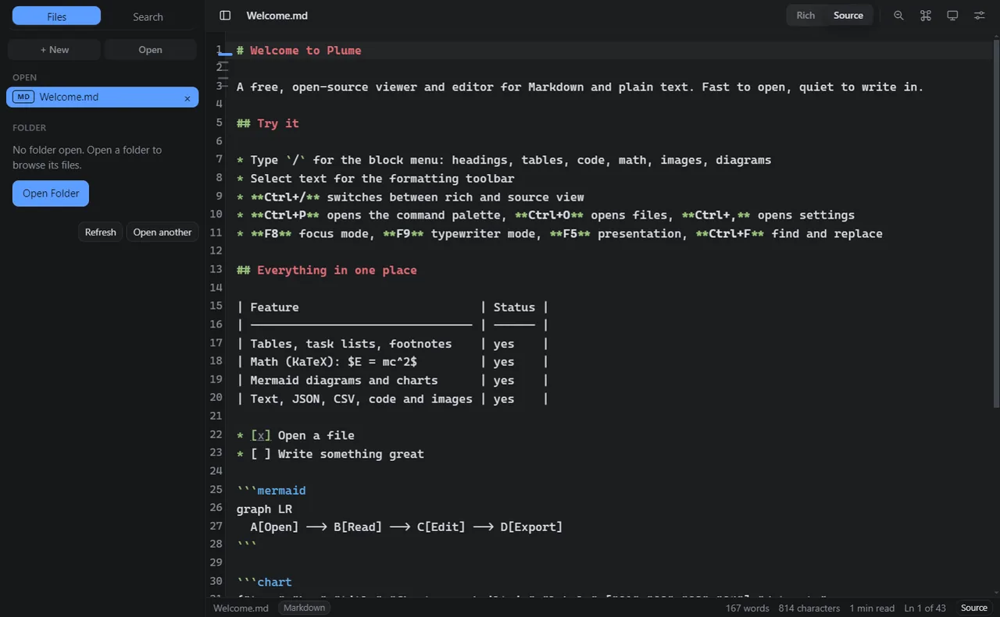
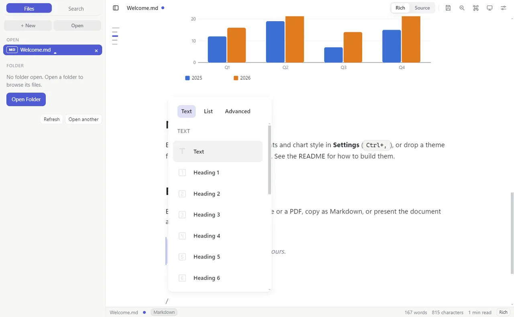
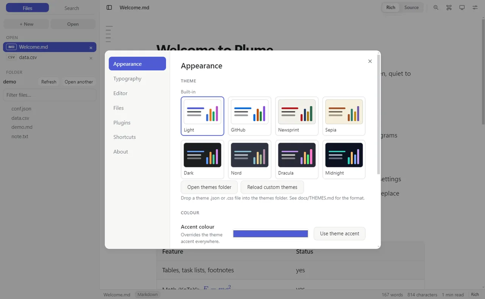
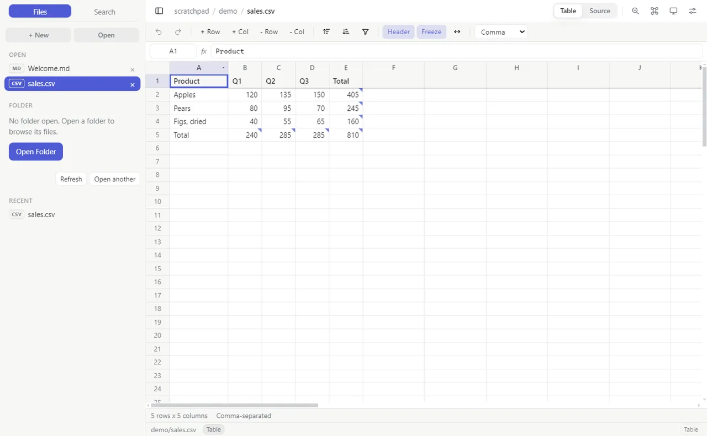
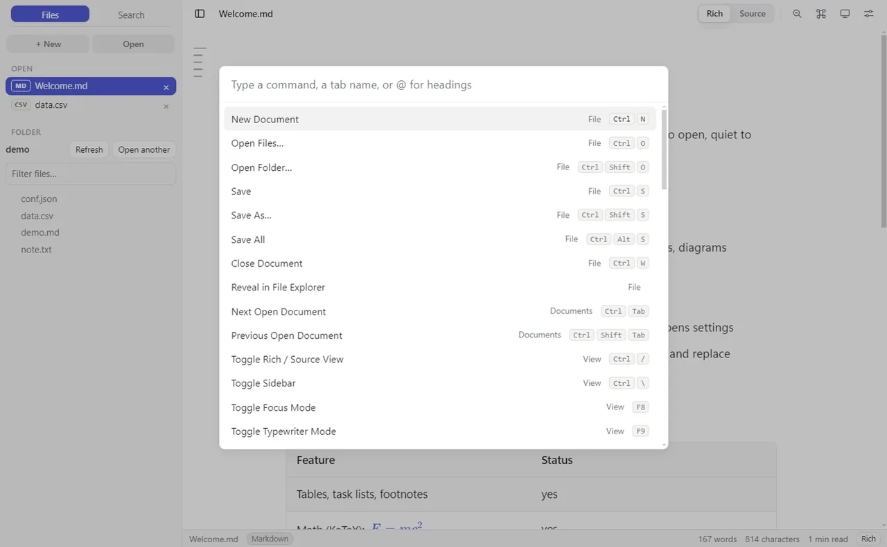

<div align="center">



# Plume

**A free, open-source Markdown editor and viewer. Fast, beautiful, and made to be customised.**

[](https://github.com/SamuelNDCE/plume/releases/latest)
[](LICENSE)


[](docs/PLUGINS.md)

<a href="https://github.com/SamuelNDCE/plume/releases/latest"></a>

[Features](#features) &nbsp;·&nbsp; [Themes](#themes) &nbsp;·&nbsp; [Plugins](#for-developers-plugins-and-themes) &nbsp;·&nbsp; [Install](#install) &nbsp;·&nbsp; [Safety](#is-it-safe)

<br>



</div>

## Why Plume exists

I wanted a good, free, open-source Markdown editor that looked and felt right to me, and I could not find one. The ones I liked were paid or closed, and the free ones were either clunky or only half-finished. So I made my own, and I am sharing it.

Plume opens a file instantly, lets you write in rich text without ever seeing the syntax (or flip to the raw source in one keystroke), and reads the other files you work next to your notes: text, JSON, CSV, code and images. It has no account, no telemetry and no subscription. Everything about how it looks, from the fonts to how charts are drawn, can be changed, and anyone can write a theme or a plugin.

## Download

<div align="center">

### [⬇ Get the latest Plume from Releases](https://github.com/SamuelNDCE/plume/releases/latest)

</div>

| System | Download |
| --- | --- |
| **Windows** | `Plume-<version>-win-x64-setup.exe` (installer) or `Plume-<version>-win-x64-portable.exe` |
| **macOS** | `Plume-<version>-mac-arm64.dmg` |
| **Linux** | `Plume-<version>-linux-x86_64.AppImage` or `Plume-<version>-linux-amd64.deb` |

Updates are built in: when a new version is out, Plume tells you and you click once to install it (see [Updates](#updates)). Builds are not code-signed yet, so your system may show a warning the first time; see [Is it safe?](#is-it-safe).

## See it

<div align="center">

<br><sub>The outline rail: one line per heading down the left edge. Click a line to jump there; hover to see the names.</sub>
<br><br>

<br><sub>Diagrams and charts render inline and follow the theme. Shown: Midnight.</sub>
<br><br>

<br><sub>Eight very different built-in themes: Light, GitHub, Newsprint and Sepia, then Dark, Nord, Dracula and Midnight.</sub>
<br><br>

<br><sub>One keystroke (<code>Ctrl+/</code>) flips between rich view and highlighted source.</sub>
<br><br>

<br><sub>Type <code>/</code> to add headings, tables, code, math, images and diagrams without leaving the keyboard.</sub>
<br><br>

<br><sub>Pick a theme, change fonts, sizes, widths and chart style, or write your own CSS.</sub>
<br><br>

<br><sub>Not only Markdown: CSV and TSV open as a sortable, filterable table.</sub>
<br><br>

<br><sub>Everything is a command. <code>Ctrl+P</code> finds it.</sub>
</div>

## Features

**Writing in Markdown**
- Rich WYSIWYG editing on ProseMirror, with a slash menu and a selection toolbar
- Rich view and raw source view, switch with `Ctrl+/`; edits carry across both
- Tables, task lists, footnotes, fenced code with highlighting, KaTeX math
- Mermaid diagrams (flowcharts, sequence, gantt and more), loaded only when a document uses one
- Built-in `chart` blocks (bar, line, area, pie) from a few lines of JSON, styled by your theme
- Paste or drop images; they are saved to an `assets/` folder beside the file

**More than Markdown**
- Plain text, JSON, YAML, XML, HTML and code, with syntax highlighting and line numbers (CodeMirror 6)
- CSV and TSV as a sortable, filterable table that stays fast on large files
- Images with zoom, pan and fit

**Working with files**
- Open as many documents as you like; they sit in a library list, no tab bar
- Folder tree, recent files, search across a whole folder, and the outline rail (below)
- Create, rename, trash and reveal files from the sidebar
- Autosave, session restore, and automatic reload when a file changes on disk

**The outline rail**
- A slim strip of lines down the left edge of the document, one per heading, starting at the top
- Length and thickness show the level: the thickest, longest line is a title, thinner and shorter lines are sub-sections
- Click any line to jump straight to that heading; hover to see the heading names, with the section you are in highlighted
- Shown only in rich view, so it never gets in the way of source code or tables

**Reading and writing aids**
- Find and replace with case, whole word and regex, in rich and source views
- Command palette with fuzzy search, go-to-file and heading jump
- Focus mode, typewriter mode, reading mode, zen mode, presentation mode (split on `---`)
- Spellcheck, word count, reading time

**Export**
- Self-contained HTML, PDF, print, copy as Markdown or HTML

## Themes

Plume ships with exactly eight themes, chosen to be properly different from each other rather than eight shades of grey. A theme controls the whole look: colours, fonts, heading style, spacing, and how charts and diagrams are drawn.

| Light | Dark |
| --- | --- |
| **Light**: clean, modern sans | **Dark**: neutral charcoal |
| **GitHub**: the familiar README look | **Nord**: cool arctic blues |
| **Newsprint**: newspaper serif, narrow column | **Dracula**: vivid purple, monospaced |
| **Sepia**: warm book page, generous spacing | **Midnight**: deep navy, elegant serif |

Beyond the eight, you can change fonts (body, headings, code), heading scale, paragraph spacing, accent colour and chart style in Settings, or paste your own CSS. Writing a whole new theme is a single JSON file: see [docs/THEMES.md](docs/THEMES.md).

## Updates

Plume checks GitHub for a newer release when it starts and shows a small card: **Update**, then **Restart and install**. That is it.

- **Windows installer and Linux AppImage:** download and install in place, one click.
- **macOS, the portable Windows exe and the Linux `.deb`:** Plume tells you a new version exists and opens the download page.
- Turn the startup check off in Settings, Files, Updates. With it off Plume makes no network requests at all.

## Install

Grab a build from [Releases](https://github.com/SamuelNDCE/plume/releases/latest) (table above), or build it yourself:

```bash
git clone https://github.com/SamuelNDCE/plume.git
cd plume
npm install
npm start
```

Needs [Node.js](https://nodejs.org) 20 or newer. To make an installer for your system:

```bash
npm run dist
```

Output goes to `release/`.

## Is it safe?

Plume is small and does little by design.

- **No telemetry, no accounts, no ads.** The only network request Plume makes is the optional update check to GitHub, which you can turn off. (A document that links a remote `https` image will load it, like any viewer.)
- **Locked-down window.** Context isolation and the renderer sandbox are on, Node integration is off, and a Content-Security-Policy blocks inline and remote scripts. The window reaches your disk only through a short list of named calls in [`electron/preload.cjs`](electron/preload.cjs).
- **Links.** Only `http`, `https` and `mailto` links are ever handed to your system.
- **Plugins are off by default** and you are warned before enabling one. See the security note in [docs/PLUGINS.md](docs/PLUGINS.md).
- **Open source.** Read it, build it, change it.

**Verify a download.** Each release ships `SHA256SUMS.txt` and a signed build-provenance attestation made by the public GitHub Actions workflow, proving the file was built from this repository:

```bash
sha256sum -c SHA256SUMS.txt
```

```bash
gh attestation verify Plume-<version>-win-x64-setup.exe --repo SamuelNDCE/plume
```

**Code signing.** Binaries are not yet signed with a Windows (Authenticode) or Apple certificate, which is why the OS may warn on first run. Use the checksum and attestation above, or build from source. Report vulnerabilities privately: see [SECURITY.md](SECURITY.md).

## For developers: plugins and themes

Plume is built to be extended. There are two ways, and neither needs you to touch the core app.

### Make a theme (no code)

A theme is one JSON file dropped in the themes folder (Settings, Appearance, Open themes folder):

```json
{
  "id": "my-theme",
  "name": "My Theme",
  "dark": false,
  "vars": { "--bg": "#fdf6e3", "--fg": "#3b3b3b", "--accent": "#d33682" },
  "typography": { "heading": "Georgia, serif", "lineHeight": 1.8, "width": 760 },
  "chart": { "colors": ["#d33682", "#268bd2", "#2aa198", "#b58900"], "style": "smooth" }
}
```

Colours, fonts, heading style, and how charts and Mermaid diagrams are drawn are all themeable. Full reference: [docs/THEMES.md](docs/THEMES.md), with three examples in [`examples/themes/`](examples/themes).

### Make a plugin (a little JavaScript)

A plugin is a folder with a `plugin.json` and an `index.js`:

```js
export function activate(api) {
  api.commands.register({
    id: 'hello',
    title: 'Insert greeting',
    run: () => api.editor.insertText('Hello from my plugin!'),
  })

  // Add your own fenced block type: ```timeline ... ```
  api.blocks.register('timeline', (code) => renderMyTimeline(code))
}
```

The API lets a plugin:

| Can | How |
| --- | --- |
| Add commands and shortcuts | `api.commands.register` |
| Read and change the open document | `api.editor.*` |
| Render custom code blocks (diagrams, charts, embeds) | `api.blocks.register` |
| Add themes | `api.themes.register` |
| Add status-bar items and header buttons | `api.ui.*` |
| Listen to app events (save, open, theme change) | `api.on` |
| Keep its own settings | `api.storage` |

Three working examples are in [`examples/plugins/`](examples/plugins): a daily word-goal counter, a timeline block renderer, and a snippet inserter. The full guide, manifest reference and security model are in [docs/PLUGINS.md](docs/PLUGINS.md).

> Plugins are ordinary JavaScript running inside the app window, with access to your open documents. They are off until you enable them in Settings, and you should only enable plugins you trust.

### Work on Plume itself

```bash
npm install
npm run dev
```

Then, in another terminal, `VITE_DEV_URL=http://localhost:5199 npm run app` (PowerShell: `$env:VITE_DEV_URL='http://localhost:5199'; npm run app`).

| Path | What |
| --- | --- |
| `electron/` | Main process, the preload bridge, the updater, plugin and theme loaders |
| `src/main.js` | App core: documents, views, boot |
| `src/modules/` | Features. Each exports `init(app)`; the contract is at the top of `src/app.js` |
| `src/themes/` | Theme registry and the eight built-in themes |
| `src/plugins.js` | Plugin loader and the plugin API |
| `docs/` | Plugin guide, theme guide |
| `DESIGN.md` | Design tokens and rules |

Contributions are welcome: see [CONTRIBUTING.md](CONTRIBUTING.md). Good places to start are a new theme, an example plugin, or any issue labelled `good first issue`.

## Keyboard shortcuts

| | |
| --- | --- |
| `Ctrl+O` / `Ctrl+Shift+O` | Open files / folder |
| `Ctrl+N` | New document |
| `Ctrl+S` / `Ctrl+Shift+S` | Save / Save as |
| `Ctrl+W` | Close document |
| `Ctrl+/` | Rich / source view |
| `Ctrl+P` | Command palette |
| `Ctrl+F` / `Ctrl+H` | Find / replace |
| `Ctrl+Z` | Undo in source view |
| `Ctrl+Shift+Z` / `Ctrl+Y` | Redo in source view |
| `Ctrl+Shift+F` | Search folder |
| `Ctrl+,` | Settings |
| `F5` | Presentation |
| `F8` / `F9` | Focus / typewriter mode |
| `Ctrl+=` `Ctrl+-` `Ctrl+0` | Font size |

The full, always-accurate list is in Settings, under Shortcuts.

## Built with

[Electron](https://www.electronjs.org), [Milkdown](https://milkdown.dev) (ProseMirror), [CodeMirror 6](https://codemirror.net), [Mermaid](https://mermaid.js.org), [KaTeX](https://katex.org), [Vite](https://vite.dev).

## License

[MIT](LICENSE). Free to use, change and share.
